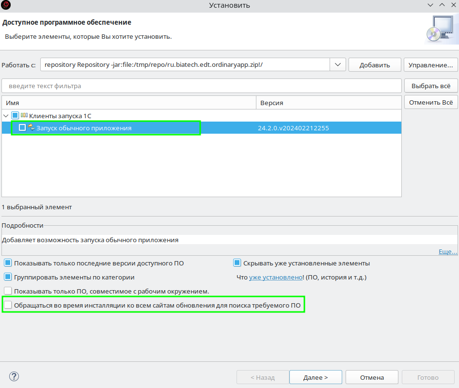

# Плагин для запуска обычного приложения из EDT

## Возможности

Добавляет новый тип запускатора 1С:Предприятия

Работает с оффлайн версией EDT 2021.3+

## Установка

Для избежания некоторых проблем лучше использовать offline версию EDT.

1. Скачайте архив плагина со страницы [релизов](https://github.com/bia-technologies/edt-runordinaryapplication-plugin/releases/latest)

   
2. Перейдя в 1C:EDT, воспользуйтесь стандартным установщиком eclipse - `Справка` -> `Установить новое ПО`
3. Добавьте репозиторий, выбрав `архив` укажите путь к скачанному архиву плагина.

   
4. Отметьте нужный плагин

   
5. Для ускорения установки можно убрать галочку `Обращаться во время инсталляции ко всем сайтам ...` (внизу)
6. `Далее`
7. После необходимо ознакомиться и принять лицензионной соглашение.
8. И согласиться с предупреждением безопасности.

    
9. Перезагрузить IDE
10. Не редко возникает проблема, что после установки плагин не активируется, для это необходимо запустить EDT с ключом `-clean`.
    1. Открыть терминал (консоль)
    2. Перейти в каталог установки EDT `cd /opt/1C/1CE/components/1c-edt-2023.2.4+6-x86_64/`
    3. Запустить EDT с ключом `./1cedt -clean`
